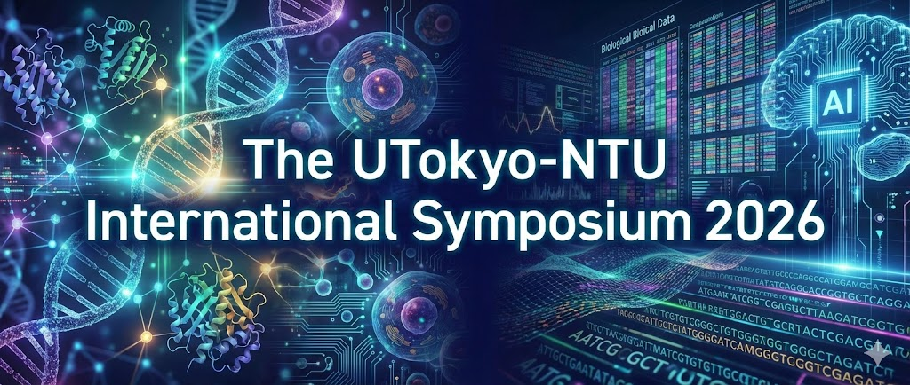

  

# The UTokyo-NTU International Symposium 2026:
{: .text-center }
# "Quantitative Biosciences and Advanced Technologies"
{: .text-center } 
## April 13–14, 2026 
{: .text-center } 
### Cell Auditorium, Institute for Quantitative Biosciences 
{: .text-center } 
### University of Tokyo, Tokyo, Japan 
{: .text-center }

---

## Aim

Due to rapid advances in measurement technologies, the demand for analyzing massive datasets is increasing in fields such as neural activity analysis, genome analysis, disease diagnosis, and drug discovery. Researchers have been developing new technologies across diverse biological modalities and building AI-based models of biological systems to predict function. Meanwhile, generative AI has advanced remarkably in industry. Integrating these technologies and translating them into transformative discoveries is critically important.

The symposium aims to foster interdisciplinary discussion and international collaboration. Speakers will include researchers at the forefront of life sciences, as well as experts in cutting-edge technologies such as AI and quantum computing. Through the academic exchange between the Institute for Quantitative Biosciences (IQB) at the University of Tokyo and the Center for Advanced Computing and Imaging in Biomedicine (CACIB) at National Taiwan University, we are expanding our international research network.

## Organizing Chairs

- Katsuhiko Shirahige (Laboratory of Genome Structure and Function)
- Yukihide Tomari (Laboratory of RNA Function)
- Ryuichiro Nakato (Laboratory of Computational Genomics)
- Akihiro Funamizu (Laboratory of Neural Computation)

## <a href="https://ut-ntu-2026.iqb.u-tokyo.ac.jp//speakers/">Speakers</a>

## <a href="https://ut-ntu-2026.iqb.u-tokyo.ac.jp/schedule/">Program</a>

## Registration

Please register using the Google Form. Once your registration is confirmed, we will send you with details about accessing the building on the day of the event.

<a href="https://docs.google.com/forms/d/e/1FAIpQLSdYvO_5Xonx8GP5dVjzsLWubKh5DnpTA9UN-MLC6yaDRf5Sgw/viewform?usp=sharing&ouid=106344295041816323435&pli=1&authuser=0">Google Form</a>

## Venue Information

**Institute for Quantitative Biosciences, the University of Tokyo**  
Cell Auditorium, Main Building, Tokyo, Japan

The nearest station is Todaimae (東大前) Station of the Tokyo Metro Nanboku line.

<iframe src="https://www.google.com/maps/embed?pb=!1m18!1m12!1m3!1d5447.958947290992!2d139.75808313826528!3d35.716975933715915!2m3!1f0!2f0!3f0!3m2!1i1024!2i768!4f13.1!3m3!1m2!1s0x60188c324c8e6e53%3A0xbf06c36f43d7af77!2z44CSMTEzLTAwMzIg5p2x5Lqs6YO95paH5Lqs5Yy65byl55Sf77yR5LiB55uu77yRIOWIhuWtkOe0sOiDnueUn-eJqeWtpueglOeptuaJgA!5e0!3m2!1sja!2sjp!4v1728531836066!5m2!1sja!2sjp" width="600" height="450" style="border:0;" allowfullscreen="" loading="lazy" referrerpolicy="no-referrer-when-downgrade"></iframe>

---

## Sponsors

- Institute for Quantitative Biosciences
- Japanese Neural Network Society
- The Naito Foundation
